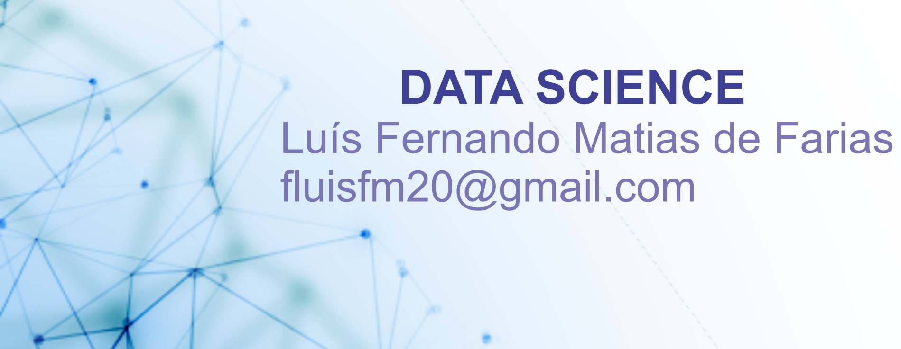

   

 

# :pushpin: Luís Fernando Matias de Farias
## :dart: Data Scientist

* :mortar_board: I am graduated in Mechatronics Engineering from the Federal Institute of Education, Science, and Technology of Ceará (IFCE) in Brazil. Also, I have a technical course in Electrotechnical at IFCE.

* :books: I've completed an English course at Municipal Human Resources Development Institute (Imparh) in Brazil.

* :mag: Searching for new remote jobs with Data Science and Machine Learning using Python language.

**Background in:** Python, Machine Learning, MATLAB, Deep Learning, TensorFlow, and Scikit Learn.

     

 
## :globe_with_meridians: Links and Email:
* :page_with_curl: Check out my [LinkedIn](https://www.linkedin.com/in/lu%C3%ADs-fernando-matias-de-farias-52234b20a/)
* :computer: How to reach me fluisfm20@gmail.com

## :battery: Projects:
### Below are the codes that I've made:

* **:ship:  Titanic: Machine Learning from disaster:** https://bit.ly/2QFW37U

---

